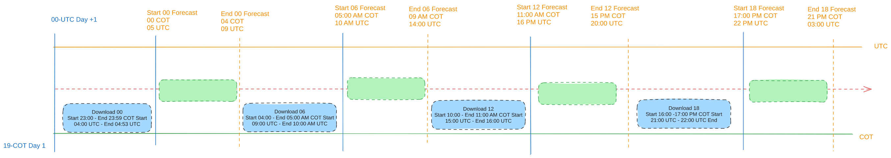

# Introducción
El siguiente es un manual rápido del código del proceso de automatización y estructuración de la corrida del modelo WRF desarrollado para la Fuerza Aérea Colombiana.

**Versiones**
- **Version:** 2.0
- **Resumen:** Actualización para nuevo cluster Cray.  
- **Fecha:** Mayo 16 de 2024
- **Autor:** Esteban Hernández B. eshernan@gmail.com
- **Descripción:** En esta versión se incluyen elementos del gestor de slurm, el manejo y actualización de scripts, una parte de automatización y los cambios que fueron requeridos en el código Python para que todo quedara funcionando de manera adecuada. 

## Estructura del código, procesos y archivos

La siguiente es la vista de la organización de los archivos, carpetas y scripts que se ven involucrados en el proceso de corrida:

El sistema de archivos dentro de los nuevos nodos cray, ser basan en un filesystem nfs montado, en donde residen todo los binarios, fuentes, scripts para que el proceso del modelo corra de manera adecuada. 

El filesystem base es 
```bash
/nfs/user/working/wrf4
```

- **arw**
    - **control**
        - **scripts** _(código de automatización)_
        - **namelist** _(templates de los namelists)_
        - **automation** (scripts de automatización)
    - **data** _(datos de entrada)_
        - **yyyymmdd-hh**
            - **gfs**
            - **metar**
            - **synop**
            - **radiom**
            - **sound**
    - **system**
        - **model** _(modelo WRF completo)_
        - **wps_light** _(ejecutables del WPS)_
        - **wrf_light** _(ejecutables del WRF)_
        - **wrfda_light** _(ejecutables del WRFDA)_
    - **corridas** _(corrida en frio del modelo)_
        - **yyyymmdd-hh**
            - **logs** _(registros de la corrida)_
            - **wrfda**
                - **obsproc** _(ejecución y salidas de obsproc)_
                    - **litR** _(datos de asimilación convertidos)_
                - **low_bc** _(ejecución y salidas de low_bc)_
                - **3dvar** _(ejecución y salidas de 3dvar)_
                - **lat_bc** _(ejecución y salidas de lat_bc)_
            - **wps** _(ejecución y salidas de geogrid, ungrib, metgrid)_
            - **real** _(ejecución y salidas de real)_
            - **fcst** _(ejecución y salidas del wrf)_
    - **rap** _(corrida en caliente del modelo)_
        - **yyyymmdd-hh**
            - **logs** _(registros de la corrida)_
            - **wrfda**
                - **obsproc** _(ejecución y salidas de obsproc)_
                    - **litR** _(datos de asimilación convertidos)_
                - **low_bc** _(ejecución y salidas de low_bc)_
                - **3dvar** _(ejecución y salidas de 3dvar)_
                - **lat_bc** _(ejecución y salidas de lat_bc)_
            - **fcst** _(ejecución y salidas del wrf)_


## Estructura de los scripts de automatización

La siguiente es el orden y estructura de los scripts de automatización y corrida del modelo WRF ubicados en `/nfs/users/working/wrf4/control/scripts_op`:

- **p1_download**
- **p2_preparation**
- **p3_wps**
    - **geogrid**
    - **ungrib**
    - **metgrid**
- **p4_real**
    - **real**
- **p5_wrfda**
    - **obsproc**
    - **low_bc**
    - **3dvar**
    - **lat_bc**
- **p6_fcst**
    - **wrf**


***Scrips para ejecutar Jobs de slurm***
dentro de la carpeta `./slurm` se encuentran los siguientes scripts que se encargan de generar los scripts de jobs de slurm que se correran por cada ejeución de acuerdo a los parámetros establecidos 
```bash 
Geogrib_run.sh.template
Metgrid_run.sh.template
Obsproc_run.sh.template
Realm_run.sh.template
WRF_run.sh.template
da_wrfvar.sh.template
```

Además se pueden encontrar los siguientes scripts, encargados de establecer las variables de ambientes necesarias, la generación del `LD_LIBRARY_PATH` y  otras variables de ambiente requeridas para la ejecución.
```bash
WRF_env.sh
set_env_wrfda.sh
```
Tambien se creo la carpeta `utils` para guardar scripts que se utilizan de manera esporádica, en la generación de los archivos de background error `be.dat`

## Ejecución, control y registro

Hay tres niveles de control y modificaciones de la corrida y de los procesos, estos son; `los argumentos de corrida` que son los que se pasan en la ejecución de la automatización y son las variables que mas varían, los siguientes son `las variables dentro del settings.ini` donde se configuran las principales variables de la corrida y procesos, y por ultimo las modificaciones dentro de los templates de los namelist y modificaciones dentro código (aunque no es recomendado) donde se pueden, si se requieren, ajustes mayores de la corrida y del modelo.

### Argumentos de corrida

Los scripts de automatización se encuentran en /arw/control/scripts, ahí esta el script principal que se encarga del todo el proceso llamado main.py. El script de automatización tiene la siguiente estructura de corrida:


    python3 main.py --start-date START_DATE --run-time RUN_TIME --run-type {warm,cold}

    Argumentos:
        --start-date START_DATE (fecha de la corrida YYYY-MM-DD)
        --run-time RUN_TIME (hora de la corrida)
        --run-type {warm,cold} (tipo de corrida del modelo)

Donde los tres argumentos son necesarios, en importante tener en cuenta que al correr el proceso no se vera ninguna salida o mensaje en la misma terminal de ejecución, todo se redireccionara a los logs de corrida.

### Settings y flags de ejecución

Las principales variables de configuración de las corridas y del modelo se encuentran dentro del archivo llamado `settings.ini` localizado junto al main.py y es la que permite realizar modificaciones de manera rápida, practica y sencilla sin alterar ni modificar el código.

La estructura y bloques del settings son los siguientes:

- **flags**
    _Banderas de corrida para habilitar o deshabilitar procesos y/o subprocesos en la ejecución_
- **globals**
    _Variables globales del proceso de ejecución_
- **download**
    _Configuraciones del proceso de descarga_
- **process**
    _Configuraciones del proceso de corrida del modelo WRF_
- **assim**
    _Configuraciones del proceso de asimilación_
- **rap**
    _Configuraciones del proceso de la corrida en caliente_

### Logs

Cada corrida guarda sus propios logs de la ejecución, estos son almacenados en `/nfs/user/working/wrf4/corridas/yyyymmdd-hh/logs` y son:

- main.log
- geogrid.log
- metgrid.log
- real.log
- ungrib.log
- wrf.log

Donde el `main.log` es el log principal de registro del proceso y los otros son los logs de su respectivo proceso. Tener en cuenta que aunque se redirecciona mensajes y errores a los logs, si ocurre un problema, por ejemplo en el wrf, el log del wrf posiblemente no se va a ver reflejado el error en detalle, se tiene que revisar los archivos rsl.error.0000 y rsl.out.0000 respectivos de la corrida.

### MPI --Deprecated
<strike>
Los scripts de automatización detectan, en el momento justo de cada una de los procesos que corre en paralelo, los nodos disponibles para incluirlo en la corrida. Los procesos que corren en paralelo son:

- geogrid *
- metgrid *
- real
- obsproc *
- 3dvar
- wrf
  
\* Estos procesos por limitancia o recomendación misma del programa corren en paralelo pero unicamente en el master.

Si uno de los nodos no responde o no es detectado en el momento de la configuración del mpi en la corrida, este no lo va a tener en cuenta para los procesos en paralelo, para ello se creo el archivo `mpd.conf` donde se registra con cuantos y cuales nodos corrió el proceso en paralelo ubicado en su respectiva carpeta de logs de la corrida `/arw/{run,rap}/yyyymmdd-hh/logs`
</strike>.

### SLURM Jobs

La ejecución de los procesos intensivos en cómputo se hacen mediante el sometimiento de un job que se ejecuta mediante slurm como el manejador de trabajos. 

El proceso es el siguiente: El proceso en Python, hace un llamdo externo  y somete un job de slurm a la cola predeterminada y queda en espera de una respuesta del job. 

Una vez python lanza el job, pierde el control sobre el proceso y es Slurm quien controla el tiempo de vida, los recursos y los elementos de ejecución. 

**Nota**: Los Jobs de slurm se parametrizan mediante variables propias del slurm como:

```bash
#SBATCH --time=05:00:00
#SBATCH --export=ALL
#SBATCH --hint=multithread
#SBATCH --exclusive
#SBATCH --nodes=3
```


Sin embargo, cuando este proceso se invoca desde el python, dichas variables se pierden y no tienen relevancia dentro de la ejecuciòn, por lo cual se debe establecer unas variables internas. 


Por ejemplo 

```bash 
export OMP_NUM_THREADS=2
export OMP_STACKSIZE=4G
export PPN=32
export TASK=96
export NODES=3
##############################
#export LD_PRELOAD=/nfs/stor/intel/oneapi/itac/latest/slib/libVT.so
#export VT_LOGFILE_NAME=WRF-trace-MPI.stf
#export VT_LOGFILE_FORMAT=SINGLESTF
#export VT_PCTRACE=5


#srun -v --mpi=pmi2 --ntasks=$np --cpus-per-task=$OMP_NUM_THREADS --tasks-per-node=$ppn --distribution=block:block,pack --cpu-bind=verbose  $Data_Dir/wrf.exe 2>&1 | tee wrf.out.${SLURM_JOBID}
echo "The start date is $(date +'%D:%T')"  >  ${Data_Dir}/../logs/wrf.log
srun --nodes=$NODES --ntasks=$TASK  --tasks-per-node=$PPN --cpus-per-task=$OMP_NUM_THREADS --mpi=pmi2 --distribution=block:block,pack --cpu-bind=verbose  $Data_Dir/wrf.exe 2>&1 | tee -a $Data_Dir/../logs/wrf.log
echo "The end date is $(date +'%D:%T')" >>  ${Data_Dir}/../logs/wrf.log
```


## Ejecucion automatica basada en ventanas


Para la ejecucion de manera periodica de los procesos del modelo, existen una serie de scripts localizados en la carpeta 

```bash 
[run@hpc-master automation]$ pwd
/nfs/users/working/wrf4/control/automation
[run@hpc-master automation]$ ls -lta *.sh 
-rwxrwxr-x 1 run run  2603 May 20 12:05 lanzar_download_gfs.sh
-rwxrwxr-x 1 run run 10231 May 20 12:05 WRFControl.sh
-rwxrwxr-x 1 run run 12343 May 17 16:16 getGFS_aria.sh
-rwxrwxr-x 1 run run  8427 May 17 16:16 downcep_nomad8.sh
[run@hpc-master automation]$ 
```

Dentro de este proceso se establen unas ventanas de ejecucion y de descargas, basadas en cuando esten la informacion del modelo GFS y de cuanto tarda la simulacion. Esto se describe en la siguiente figura



La ejecucion automatica quedo configurada como un crontab de la siguiente manera

```bash
crontab -l
*/10 * * * * /nfs/users/working/wrf4/control/automation/lanzar_download_gfs.sh &>> /tmp/descarga_gfs.log
*/10 * * * * /nfs/users/working/wrf4/control/automation/WRFControl.sh &>> /tmp/wrfcontrol.log 
```
