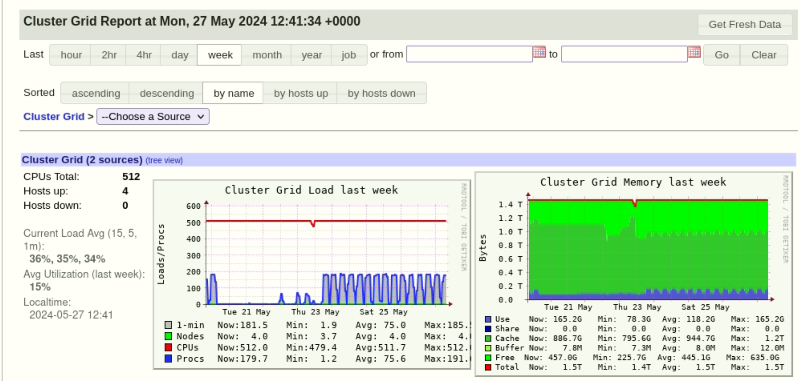
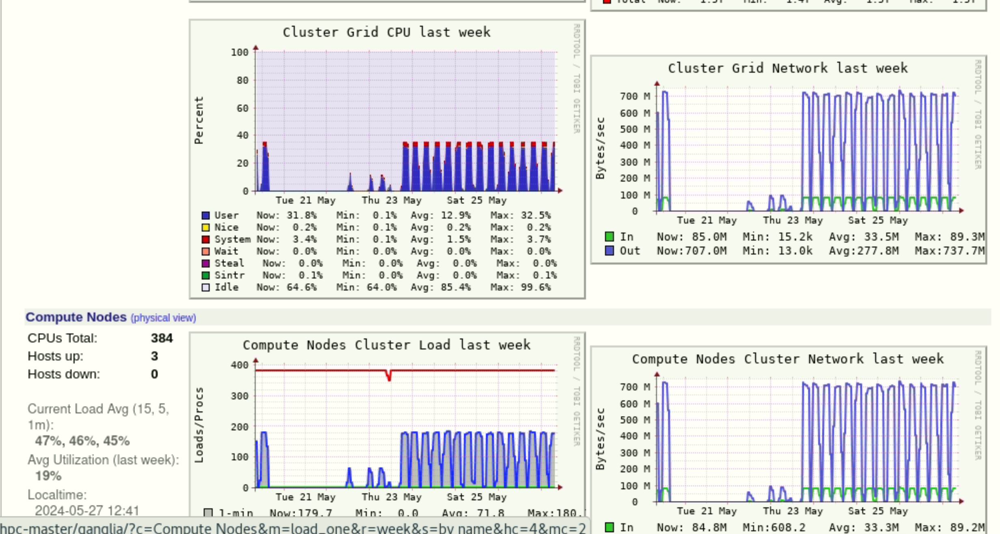
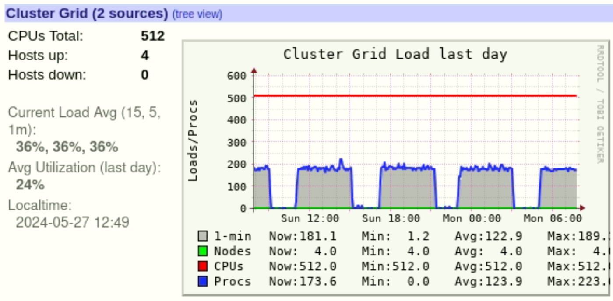
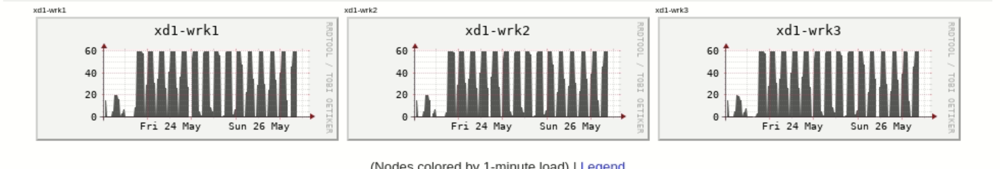

**Versiones**
- **Version:** 1.0
- **Resumen:** Proceso de automatizacion del pipeline de simulacion 
- **Fecha:** Mayo 26 de 2024
- **Autor:** Esteban Hernández B. eshernan@gmail.com
- **Descripción:** En esta version se describe el proceso de automatizacion del pipeline de simulacion, para el modelo WRF, incluyendo la calendarizacion del mismo. 


# Introducción
El proceso de automatizacion de las ejecuciones, esta controlado por una serie de scripts que se ubican en  `/nfs/users/working/wrf4/control/automation`
dentro de esta carpeta encontramos
```bash 
[run@hpc-master automation]$ pwd
/nfs/users/working/wrf4/control/automation
[run@hpc-master automation]$ ls -lta 
total 100
-rwxrwxr-x 1 run run  2780 May 26 08:54 DeleteoldFiles.sh
drwxrwxr-x 2 run run   235 May 26 08:54 .
-rwxrwxr-x 1 run run 11891 May 23 16:49 WRFControl.sh
-rwxrwxr-x 1 run run  2643 May 22 11:26 lanzar_download_gfs.sh
drwxrwxr-x 8 run run   204 May 22 10:59 ..
-rwxrwxr-x 1 run run 12343 May 22 10:59 getGFS_aria.sh
-rwxrwxr-x 1 run run  8427 May 22 10:59 downcep_nomad8.sh
-rw-rw-r-- 1 run run 22235 May 22 10:59 configure.wrfda
-rw-rw-r-- 1 run run 22235 May 22 10:59 configure.wrf
```

Descripcion de las responsabilidades de cada uno de los archivos 
- ***WRFControl.sh***: Este archivo es el encargado de validar el tiempo en que los archivos gfs para una hora especifica estaran disponibles, verificar si ya han sido descargados, y calcular el tiempo en que todos estaran disponibles, para lanzar el proceso completo que incluye. 
  - Procesamiento de WPS
  - Procesamiento de REAL
  - Procesamiento de WRFDA
  - Simulacion de WRF
Este control lo ejecuta calculando las ventanas de tiempo en que se puede lanzar el pipeline de simulacion  de acuerdo a las siguientes ventanas de tiempo 
***window00UTC=(4 5)
window06UTC=(10 12)
window12UTC=(16 18)
window18UTC=(22 00)***


Este proceso se dispara de manera automatica, calendarizado en un proceso de crontab,  cada 10 minutos. 

```bash 
[run@hpc-master automation]$ crontab -l
*/10 * * * * /nfs/users/working/wrf4/control/automation/lanzar_download_gfs.sh &>> /tmp/descarga_gfs.log
*/10 * * * * /nfs/users/working/wrf4/control/automation/WRFControl.sh &>> /tmp/wrfcontrol.log 
```

El mismo script controla que no se este ejecutando mas de una vez, si lo detecta procede a terminar el intento de ejecucion. Mientras esta corriendo, escribe un archivo que se borrar una vez terminado todo el proceso.  El archivo es llamado `WRFControl.sh.lock` y se ubica en la carpeta de automatizacion. 

- ***lanzar_dowload_gfs.sh**: Este archivo se encarga de comprobar las ventanas de disponibilidad de los datos GFS en diferentes ventanas de tiempo y descargarlos a la carpeta 

```bash 
[run@hpc-master data]$ pwd
/nfs/users/working/wrf4/data
[run@hpc-master data]$ ls -l
total 0
drwxr-xr-x 3 run run 25 May 23 08:00 20240523-12
drwxr-xr-x 6 run run 76 May 23 17:21 20240523-18
drwxr-xr-x 6 run run 76 May 23 23:00 20240524-00
drwxr-xr-x 6 run run 76 May 24 05:01 20240524-06
drwxr-xr-x 6 run run 76 May 24 11:01 20240524-12
drwxr-xr-x 6 run run 76 May 24 17:11 20240524-18
drwxr-xr-x 6 run run 76 May 24 23:01 20240525-00
drwxr-xr-x 6 run run 76 May 25 05:01 20240525-06
drwxr-xr-x 6 run run 76 May 25 11:01 20240525-12
drwxr-xr-x 6 run run 76 May 25 17:11 20240525-18
drwxr-xr-x 6 run run 76 May 25 23:11 20240526-00
drwxr-xr-x 6 run run 76 May 26 05:01 20240526-06
drwxr-xr-x 3 run run 25 May 26 08:00 20240526-12
```
 dentro de cada una de estas carpetas se puede encontrar la informacion descargadas de las siguientes fuentes

 ```bash 
 [run@hpc-master data]$ tree -d -L 2
.
├── 20240523-12
│   └── gfs
├── 20240523-18
│   ├── gfs
│   ├── radar
│   ├── sound
│   └── synop
├── 20240524-00
│   ├── gfs
│   ├── radar
│   ├── sound
│   └── synop
```

La validacion tambien se hace por ventanas de tiempo  de la siguiente manera 

```bash 

if [[ $hoursInt -ge 1 ]]  && [[ $hoursInt -le 6 ]]; then
   hora=00
elif [[ $hoursInt -ge 7 ]]  && [[ $hoursInt -le 12 ]]; then
   hora=06
elif [[ $hoursInt -ge 13 ]]  && [[ $hoursInt -le 18 ]]; then
   hora=12
elif [[ $hoursInt -ge 19 ]]  && [[ $hoursInt -le 23 ]]; then
   hora=18
elif [[ $hoursInt -eq 0 ]];then
   hora=00
fi
```

y como se observo anteriormente, tambien esta calendarizada mediante el mismo crontab. 

###  Monitoreo del funcionamiento 

Después de tres dias de puesta en marcha la automatización del funcionamiento, se realizó el monitoreo, del uso del cluster, del uso de CPU, Memoria y de Red. 
Los resultados se muestran a continuación:

### Para la ultima semana:




### Para el ultimo dia




### Monitoreo por Nodo 




### Administracion del sistema de archivos NFS /nfs/user 

Este sistema de archivos, actualmente sostiene toda la informacion del pipeline del WRF, ademas contiene las salidas periodicas del modelo y los datos de entrada del modelo, por lo cual produce gran cantidad de informacion y el necesario monitorearlo 


```bash
df -kh /nfs/users
Filesystem            Size  Used Avail Use% Mounted on
fmn1-hsn1:/nfs/users   11T  1.7T  8.4T  17% /nfs/users
```

Muestra que actualmente el sistema de archivos tiene 8.4 Teras de espacio y que e este 1.7T esta siendo usado, al realizar un analisis detallado de este uso encontramos lo siguiente:

```bash 


[root@hpc-master conf.d]# du -sh  /nfs/users/*
3.4M	/nfs/users/arthur
1.1G	/nfs/users/run
295G	/nfs/users/sam
3.9M	/nfs/users/user1
1.3T	/nfs/users/working
[root@hpc-master conf.d]# du -sh  /nfs/users/working/*
4.0K	/nfs/users/working/configure.wps
490G	/nfs/users/working/corridas
302G	/nfs/users/working/installers
0	/nfs/users/working/test
535G	/nfs/users/working/wrf4
[root@hpc-master conf.d]# du -sh  /nfs/users/working/wrf4
535G	/nfs/users/working/wrf4
[root@hpc-master conf.d]# du -sh  /nfs/users/working/wrf4/*
17G	/nfs/users/working/wrf4/backups
622M	/nfs/users/working/wrf4/control
458G	/nfs/users/working/wrf4/corridas
13G	/nfs/users/working/wrf4/data
16G	/nfs/users/working/wrf4/gen_be
0	/nfs/users/working/wrf4/output
31G	/nfs/users/working/wrf4/system
0	/nfs/users/working/wrf4/WRF
[root@hpc-master conf.d]# 
```

Podemos observar que el mayor consumo viene dado por el folder `/nfs/users/working/wrf4/corridas` que aporta media Tera de almacenamiento, por tanto este debe ser monitoreado de manera continua. 

Al observar como se esta generando estos consumos dentro del directorio podemos encontrar que:

```bash 
[root@hpc-master conf.d]# du -sh  /nfs/users/working/wrf4/corridas/*
0	/nfs/users/working/wrf4/corridas/20240523-18
58G	/nfs/users/working/wrf4/corridas/20240525-18
67G	/nfs/users/working/wrf4/corridas/20240526-00
68G	/nfs/users/working/wrf4/corridas/20240526-06
68G	/nfs/users/working/wrf4/corridas/20240526-12
66G	/nfs/users/working/wrf4/corridas/20240526-18
67G	/nfs/users/working/wrf4/corridas/20240527-00
67G	/nfs/users/working/wrf4/corridas/20240527-06
[root@hpc-master conf.d]# 
```

Cada corrida del modelo aporta en promedio 67GB de Datos, si sabemos que el modelo corre 4 veces por dia, podemos indicar que cada dia aporta 269G:

```bash 
[root@hpc-master conf.d]# du -sh  /nfs/users/working/wrf4/corridas/20240526-*
67G	/nfs/users/working/wrf4/corridas/20240526-00
68G	/nfs/users/working/wrf4/corridas/20240526-06
68G	/nfs/users/working/wrf4/corridas/20240526-12
66G	/nfs/users/working/wrf4/corridas/20240526-18
[root@hpc-master conf.d]# du -sh  /nfs/users/working/wrf4/corridas/20240526-* | awk  '{total+=$1}END{print total }'
269
[root@hpc-master conf.d]# 
```

Por tanto al cabo de 20 dias, se consumirian 5.3 TB que sumado a los datos iniciales  de datos GFS, podrian sumar unos 5.5 TB

```bash 
[root@hpc-master conf.d]# du -sh  /nfs/users/working/wrf4/corridas/20240526-* | awk  '{total+=$1}END{print total*20 }'
5380
[root@hpc-master conf.d]#

[root@hpc-master conf.d]# du -sh  /nfs/users/working/wrf4/data/20240526-* | awk  '{total+=$1}END{print total*20 }'
64780m
[root@hpc-master conf.d]#

```

## Limpieza automatica del filesystem 

Luego de establecer el umbral permitido para el uso del Filesystem, se utilizara el scripts denominado `DeleteoldFile.sh`, localizado en:

```bash 
[run@hpc-master automation]$ pwd
/nfs/users/working/wrf4/control/automation
[run@hpc-master automation]$ ls -l
total 100
-rw-rw-r-- 1 run run 22235 May 22 10:59 configure.wrf
-rw-rw-r-- 1 run run 22235 May 22 10:59 configure.wrfda
-rwxrwxr-x 1 run run  2780 May 26 08:54 DeleteoldFiles.sh
-rwxrwxr-x 1 run run  8427 May 22 10:59 downcep_nomad8.sh
-rwxrwxr-x 1 run run 12343 May 22 10:59 getGFS_aria.sh
-rwxrwxr-x 1 run run  2643 May 22 11:26 lanzar_download_gfs.sh
-rwxrwxr-x 1 run run 11891 May 23 16:49 WRFControl.sh
-rw-rw-r-- 1 run run    24 May 27 11:00 WRFControl.sh.lock
```

Este se encarga de evaluar el uso de este filesystem y borrar aquellos archivos mayores al umbral permitido. 


