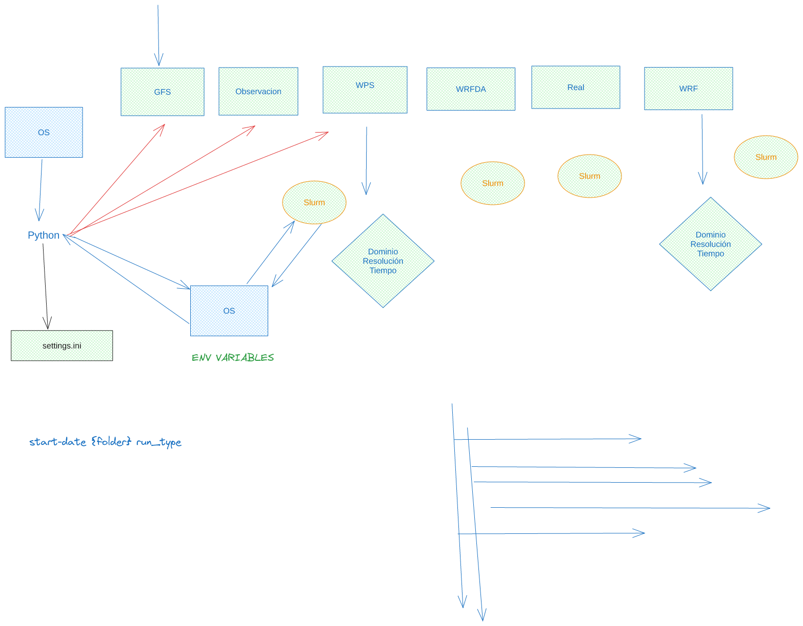
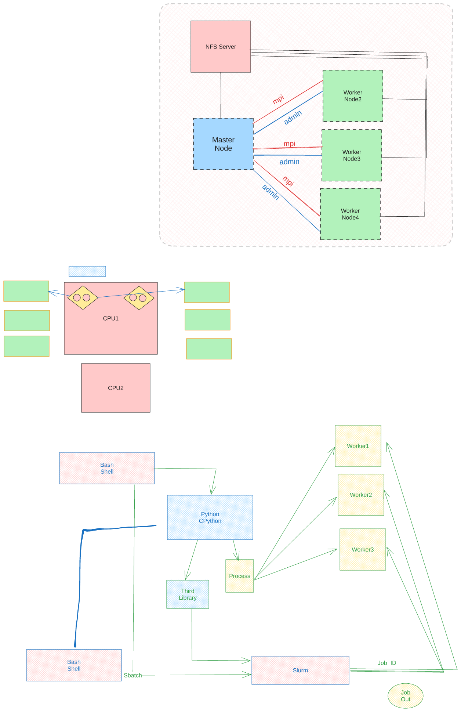
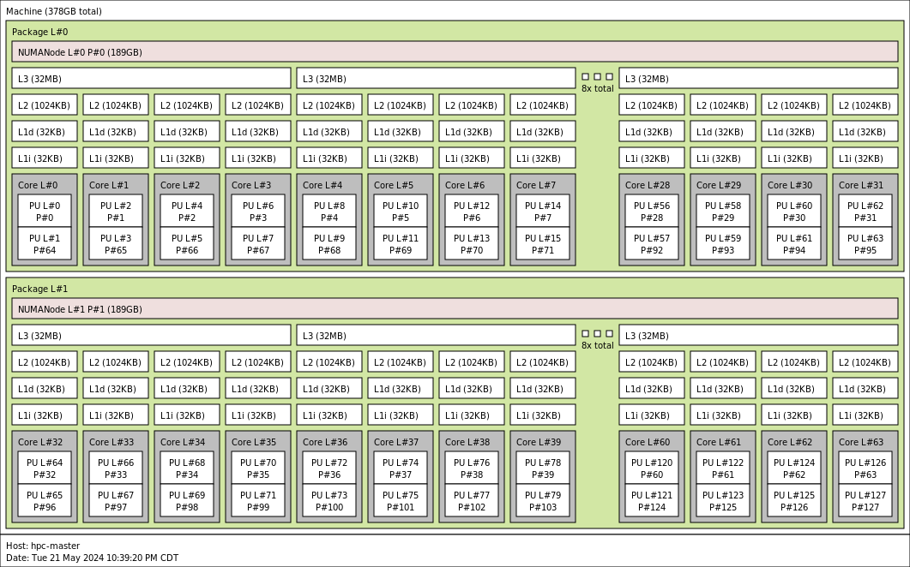
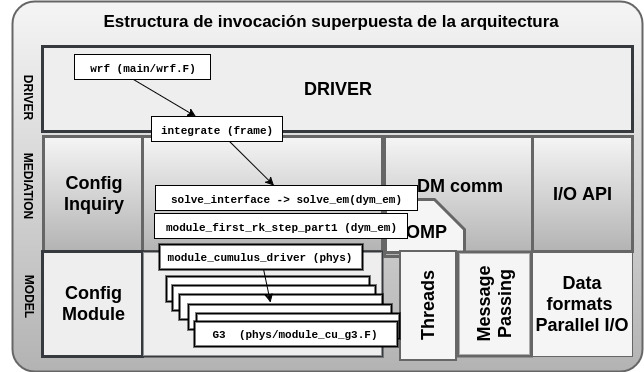
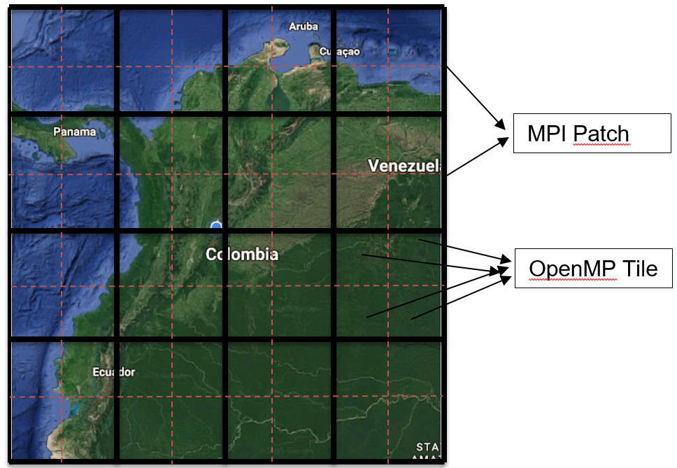
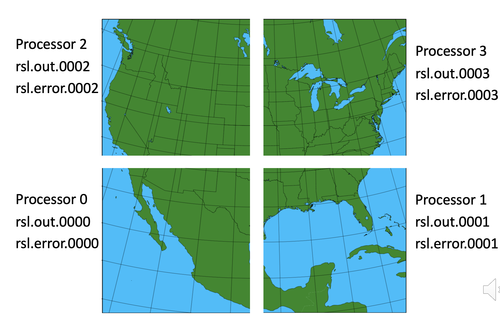

# Introducción
El proceso de compilacion del WRF, incluye varias etapas y  para lograr el mejor rendimiento requiere que cada pieza se integre de manera adeucada en cada paso del proceso. 

**Versiones**
- **Version:** 1.0
- **Resumen:** Proceso de compilacion del modelo 
- **Fecha:** Mayo 22 de 2024
- **Autor:** Esteban Hernández B. eshernan@gmail.com
- **Descripción:** En esta version se describe el proceso de compilacion del WRF con OneAPi version 2024. 

## Librerias requeridas 

Para el proceso de compilacion se requieren las siguientes librerias 
```bash 
wget https://downloads.unidata.ucar.edu/netcdf-fortran/4.6.0/netcdf-fortran-4.6.0.tar.gz
wget https://downloads.unidata.ucar.edu/netcdf-c/4.9.0/netcdf-c-4.9.0.tar.gz
wget https://parallel-netcdf.github.io/Release/pnetcdf-1.12.3.tar.gz
wget https://support.hdfgroup.org/ftp/HDF5/releases/hdf5-1.12/hdf5-1.12.0/src/hdf5-1.12.0.tar.gz
wget --no-check-certificate https://www2.mmm.ucar.edu/wrf/OnLineTutorial/compile_tutorial/tar_files/jasper-1.900.1.tar.gz
wget --no-check-certificate https://www2.mmm.ucar.edu/wrf/OnLineTutorial/compile_tutorial/tar_files/libpng-1.2.50.tar.gz
wget --no-check-certificate https://www2.mmm.ucar.edu/wrf/OnLineTutorial/compile_tutorial/tar_files/zlib-1.2.11.tar.gz
```

con esas librerias descargadas y descomprimidas se procede a compilar una por una y dejar en un lugar comun la instalacion 

```bash 
tar -zxvf netcdf-c-4.9.0.tar.gz
tar -zxvf netcdf-fortran-4.6.0.tar.gz
tar -zxvf hdf5-1.12.0.tar.gz
tar -zxvf jasper-1.900.1.tar.gz 
tar -zxvf libpng-1.2.50.tar.gz
tar -zxvf zlib-1.2.7.tar.gz
tar -zxvf pnetcdf-1.12.2.tar.gz
```
Ademas se deben descargar el modelo WRF y WPS, clonando sus repositorios

```bash 
git clone https://github.com/wrf-model/WPS.git
git clone https://github.com/wrf-model/WRF.git
```

En el nodo master del cluster cray, los instaladores de las librerias quedaron en 
```bash 
[run@hpc-master sources]$ pwd
/nfs/users/working/installers/SHARED/sources
[run@hpc-master sources]$ ls -dl */
drwxrwxr-x 19 run run 4096 May 16 12:05 hdf5-hdf5-1_12_3/
drwxr-xr-x  9 run run 4096 Nov 16  2016 jasper-1.900.29/
drwxr-xr-x  5 run run 4096 Jul  9  2012 libpng-1.2.50/
drwxrwxr-x 32 run run 4096 May 16 12:17 netcdf-c-4.8.0/
drwxrwxr-x 12 run run 4096 May 16 12:23 netcdf-fortran-4.6.0/
drwxr-xr-x 14 run run 4096 Jan 16 21:16 zlib-1.2.11/
```
Todas las librerias fueron compiladas, colocando el path de destino en 
```c
--prefix=/nfs/users/working/installers/sam/WRF_AF/Libs_Intel/Install
```

### Uso de compilador Intel en OneAPI HPC SDK

Para obtener el mejor desempeno posible, se utilizo el compilador de Intel, que desde la version 2024.1,  tiene las siguiente novedades.

- El compilador para C y C++ es icx, 
- El compilador para fortran es ifx
- Estos compiladores estan basados en LLVM y  ya no se soporta el compilador ICC. 
**Nota: La version de `icx` e `ifx` requieren como minimo la version de `WRF4.6` de lo contrario presentara problemas de compilacion**. 

El compilador de OneAPI  se puede descargar del sitio [OneAPI Installers ](https://www.intel.com/content/www/us/en/developer/tools/oneapi/hpc-toolkit-download.html?operatingsystem=linux&distributions=offline) utilizando la version offline. 

**Nota: La instalacion de OneAPI quedo localizada en el directorio**

```bash 
hpc-master oneapi]$ pwd
/nfs/stor/intel/oneapi
[run@hpc-master oneapi]$ 
```

 con esto en cuenta se  procede a compilar e instalar todas las librerias. Una vez compiladas de manera exitosa, se deben crear las siguiente variables de ambiente. 

```bash 
export MAIN_DIR=/nfs/users/working/installers/sam/WRF_AF
export NETCDF=$MAIN_DIR/Libs_Intel/Install
export PNETCDF=$MAIN_DIR/Libs_Intel/Install
export JASPERINC=$MAIN_DIR/Libs_Intel/Install/include
export JASPERLIB=$MAIN_DIR/Libs_Intel/Install/lib
export HDF5=$MAIN_DIR/Libs_Intel/Install
export PHDF5=$MAIN_DIR/Libs_Intel/Install
export ZLIB=$MAIN_DIR/Libs_Intel/Install
export WRFIO_NCD_LARGE_FILE_SUPPORT=1
```

y ademas se debe configurar las variables del compilador. 
`source /nfs/stor/intel/oneapi/setvars.sh`
De esta manera tanto el compilador ifx como el icx quedaran disponibles para su uso, como se muestra aqui

```bash 
[run@hpc-master slurm]$ icx --version 
Intel(R) oneAPI DPC++/C++ Compiler 2024.0.1 (2024.0.1.20231122)
Target: x86_64-unknown-linux-gnu
Thread model: posix
InstalledDir: /nfs/stor/intel/oneapi/compiler/2024.0/bin/compiler
Configuration file: /nfs/stor/intel/oneapi/compiler/2024.0/bin/compiler/../icx.cfg
[run@hpc-master slurm]$ ifx --version 
ifx (IFX) 2024.0.0 20231017
Copyright (C) 1985-2023 Intel Corporation. All rights reserved.
```

Con esto configurado se procede a compilar el modelo WRF

- corriendo la configuracion que genera el archivo configure.wrf 
`./configure` con la opcion 79 Intel dm/sm
verificando que el archivo generado, tenga la siguiente configuracion 

```bash 
DESCRIPTION     =       INTEL ($SFC/$SCC) : oneAPI LLVM
DMPARALLEL      =        1
OMPCPP          =        -D_OPENMP
OMP             =        -qopenmp #-fpp -auto
OMPCC           =        -qopenmp #-auto
SFC             =       ifx
SCC             =       icx
CCOMP           =       icx
DM_FC           =       mpiifort
DM_CC           =       mpiicx
FC              =       time $(DM_FC)
CC              =       time $(DM_CC)
LD              =       $(FC)
RWORDSIZE       =       $(NATIVE_RWORDSIZE)
PROMOTION       =       -real-size `expr 8 \* $(RWORDSIZE)` -i4
ARCH_LOCAL      =       -DNONSTANDARD_SYSTEM_FUNC  -DWRF_USE_CLM $(NETCDF4_IO_OPTS)
OPTAVX          =       -xCORE-AVX512
CFLAGS_LOCAL    =       -w -O3 -ip $(OPTAVX) #-xHost -fp-model fast=2 -no-prec-div -no-prec-sqrt -ftz -no-multibyte-chars # -DRSL0_ONLY
LDFLAGS_LOCAL   =       -ip $(OPTAVX) #-xHost -fp-model fast=2 -no-prec-div -no-prec-sqrt -ftz -align all -fno-alias -fno-common
CPLUSPLUSLIB    =
ESMF_LDFLAG     =       $(CPLUSPLUSLIB)
FCOPTIM         =       -O3 
FCREDUCEDOPT	=       $(FCOPTIM)
FCNOOPT		=       -O0 -fno-inline -no-ip
FCDEBUG         =       # -g $(FCNOOPT) -traceback # -fpe0 -check noarg_temp_created,bounds,format,output_conversion,pointers,uninit -ftrapuv -u
nroll0 -u
FORMAT_FIXED    =       -FI
FORMAT_FREE     =       -FR
FCSUFFIX        =
BYTESWAPIO      =       -convert big_endian
RECORDLENGTH    =       -assume byterecl
FCBASEOPTS_NO_G =       -ip -fp-model precise -w -ftz -align all -fno-alias $(FORMAT_FREE) $(BYTESWAPIO) #-xHost -fp-model fast=2 -no-heap-array
s -no-prec-div -no-prec-sqrt -fno-common
FCBASEOPTS      =       $(FCBASEOPTS_NO_G) $(FCDEBUG)
MODULE_SRCH_FLAG =
TRADFLAG        =      -traditional-cpp $(NETCDF4_IO_OPTS)
CPP             =      /lib/cpp -P -nostdinc
AR              =      ar
ARFLAGS         =      ru
M4              =      m4
RANLIB          =      ranlib
RLFLAGS		=
CC_TOOLS        =      $(SCC)
NETCDFPAR_BUILD	=      echo SKIPPING
```
De especial atencion es  el uso de vectorizacion AVX512 
`OPTAVX          =       -xCORE-AVX512`

una vez compilado el modelo, se valida que los ejecutables fueron creados de manera adecuada en 

```bash 
[run@hpc-master WRF]$ pwd
/nfs/users/working/installers/WRF
[run@hpc-master WRF]$ ls -l ./main/*.exe
-rwxrwxr-x 1 run run 53813800 Jan 17 09:18 ./main/ndown.exe
-rwxrwxr-x 1 run run 53860376 Jan 17 09:18 ./main/real.exe
-rwxrwxr-x 1 run run 53127680 Jan 17 09:18 ./main/tc.exe
-rwxrwxr-x 1 run run 58910392 Jan 17 09:17 ./main/wrf.exe
```


Para verificar si el ejecutable de `WRF` quedo con soporte para avx, se puede ejecutar los siguientes rutinas

```bash 
objdump -d ./wrf.exe > wrf.asm
grep zmm wrf.asm | more

34067b3:	62 f1 fe 48 6f 06    	vmovdqu64 (%rsi),%zmm0
 34067c0:	62 d1 7d 48 e7 00    	vmovntdq %zmm0,(%r8)
 34067c6:	62 f1 fe 48 6f 46 01 	vmovdqu64 0x40(%rsi),%zmm0
 34067d4:	62 d1 7d 48 e7 40 01 	vmovntdq %zmm0,0x40(%r8)
 34067db:	62 f1 fe 48 6f 46 02 	vmovdqu64 0x80(%rsi),%zmm0
 34067e9:	62 d1 7d 48 e7 40 02 	vmovntdq %zmm0,0x80(%r8)
 34067f0:	62 f1 fe 48 6f 46 03 	vmovdqu64 0xc0(%rsi),%zmm0
 34067fe:	62 d1 7d 48 e7 40 03 	vmovntdq %zmm0,0xc0(%r8)
 340681a:	62 f1 fe 48 6f 46 fc 	vmovdqu64 -0x100(%rsi),%zmm0

```
Se puede observar el uso de instrucciones vectoriales avx512 `zmm0`. 


Ahora se procede a compilar una version de WRFDA. 
 
se debe hacer una copia completa de la carpeta WRF, con el nombre de WRFDA, 
y se procede a configurar y compilar de manera diferente. 

en la instalacion actual el WRF y el WRFDA quedaron de la siguiente manera
```bash 
[run@hpc-master installers]$ pwd
/nfs/users/working/installers
[run@hpc-master installers]$ ls -ld WRF*
drwxrwxr-x 21 run run 4096 May 15 18:32 WRF
drwxrwxr-x 21 run run 4096 Mar  8 10:37 WRF_BK
drwxrwxr-x 21 run run 4096 May 15 20:01 WRFDA
drwxrwxr-x 21 run run 4096 May 16 07:56 WRFDA_DEBUG
[run@hpc-master installers]$ 
``` 

El WRFDA, se debe configurar usando `./configure wrfda ->opcion 79` 
y se debe asegurar que el configure.wrf tenga la siguiente configuracion


```bash 
LIBWRFLIB = libwrflib.a

 LIB_BUNDLED     = \
                      $(WRF_SRC_ROOT_DIR)/external/fftpack/fftpack5/libfftpack.a \
                      $(WRF_SRC_ROOT_DIR)/external/io_grib1/libio_grib1.a \
                      $(WRF_SRC_ROOT_DIR)/external/io_grib_share/libio_grib_share.a \
                      $(WRF_SRC_ROOT_DIR)/external/io_int/libwrfio_int.a \
                      $(ESMF_IO_LIB) \
                      $(WRF_SRC_ROOT_DIR)/external/RSL_LITE/librsl_lite.a \
                      $(WRF_SRC_ROOT_DIR)/frame/module_internal_header_util.o \
                      $(WRF_SRC_ROOT_DIR)/frame/pack_utils.o

 LIB_EXTERNAL    = \
                      -L$(WRF_SRC_ROOT_DIR)/external/io_netcdf -lwrfio_nf -L/nfs/users/working/installers/sam/WRF_AF/Libs_Intel/Install/lib -lne
tcdff -lnetcdf   -L$(WRF_SRC_ROOT_DIR)/external/io_pnetcdf -lwrfio_pnf -L/nfs/users/working/installers/sam/WRF_AF/Libs_Intel/Install/lib -lpnetc
df   -L/nfs/users/working/installers/sam/WRF_AF/Libs_Intel/Install/lib -lhdf5hl_fortran -lhdf5_hl -lhdf5_fortran -lhdf5 -lm -lz 


#### Architecture specific settings ####

# Settings for    Linux x86_64 ppc64le i486 i586 i686, Intel oneAPI compiler with icx  (dmpar)
# This mirrors the above Intel build but changes ifort=>ifx icc=>icx

DESCRIPTION     =       INTEL ($SFC/$SCC) : oneAPI LLVM
DMPARALLEL      =        1
OMPCPP          =       # -D_OPENMP
OMP             =       # -qopenmp -fpp -auto
OMPCC           =       # -qopenmp -auto
SFC             =       ifx
SCC             =       icx
CCOMP           =       icx
DM_FC           =       mpif90 -f90=$(SFC)
DM_CC           =       mpicc -cc=$(SCC)
FC              =       time $(DM_FC)
CC              =       $(DM_CC)
LD              =       $(FC)
RWORDSIZE       =       8
PROMOTION       =       -real-size `expr 8 \* $(RWORDSIZE)` -i4
ARCH_LOCAL      =       -DNONSTANDARD_SYSTEM_FUNC  -DWRF_USE_CLM $(NETCDF4_IO_OPTS)
CFLAGS_LOCAL    =       -w -O3 -ip --std=c89 -Wno-incompatible-pointer-types -Wno-int-conversion #-xHost -fp-model fast=2 -no-prec-div -no-prec-
sqrt -ftz -no-multibyte-chars # -DRSL0_ONLY
LDFLAGS_LOCAL   =       -ip #-xHost -fp-model fast=2 -no-prec-div -no-prec-sqrt -ftz -align all -fno-alias -fno-common
CPLUSPLUSLIB    =
ESMF_LDFLAG     =       $(CPLUSPLUSLIB)
FCOPTIM         =       -O3
FCREDUCEDOPT	=       $(FCOPTIM)
FCNOOPT		=       -O0 -fno-inline -no-ip
FCDEBUG         =       # -g $(FCNOOPT) -traceback # -fpe0 -check noarg_temp_created,bounds,format,output_conversion,pointers,uninit -ftrapuv -u
nroll0 -u
FORMAT_FIXED    =       -FI
FORMAT_FREE     =       -FR
FCSUFFIX        =
BYTESWAPIO      =       -convert big_endian
RECORDLENGTH    =       -assume byterecl
FCBASEOPTS_NO_G =       -ip -fp-model precise -w -ftz -align all -fno-alias $(FORMAT_FREE) $(BYTESWAPIO) #-xHost -fp-model fast=2 -no-heap-array
s -no-prec-div -no-prec-sqrt -fno-common
FCBASEOPTS      =       $(FCBASEOPTS_NO_G) $(FCDEBUG)
MODULE_SRCH_FLAG =
TRADFLAG        =      -traditional-cpp $(NETCDF4_IO_OPTS)
CPP             =      /lib/cpp -P -nostdinc
AR              =      ar
ARFLAGS         =      ru
M4              =      m4
RANLIB          =      ranlib
RLFLAGS		=
CC_TOOLS        =      $(SCC)
NETCDFPAR_BUILD	=      echo SKIPPING
```
Una vez compilado el  WRFDA, se valida que los ejecutables fueron creados de manera adecuada en 

```bash 
/tools/fortran_2003_ieee_test.exe
./tools/fortran_2003_flush_test.exe
./tools/fortran_2008_gamma_test.exe
./tools/fortran_2003_iso_c_test.exe
./tools/nc4_test.exe
./tools/standard.exe
./var/obsproc/src/obsproc.exe
./var/obsproc/obsproc.exe
./var/build/gen_be_addmean.exe
./var/build/da_advance_time.exe
./var/build/da_tune_obs_desroziers.exe
./var/build/da_bias_sele.exe
./var/build/da_bias_scan.exe
./var/build/da_bias_verif.exe
./var/build/da_rad_diags.exe
./var/build/da_update_bc.exe
./var/build/gen_mbe_stage2.exe
./var/build/gen_be_stage2_gsi.exe
./var/build/gen_be_stage4_regional.exe
./var/build/gen_be_cov2d.exe
./var/build/gen_be_cov3d.exe
./var/build/gen_be_cov3d3d_bin3d_contrib.exe
./var/build/gen_be_cov3d3d_contrib.exe
./var/build/gen_be_cov2d3d_contrib.exe
./var/build/gen_be_cov3d2d_contrib.exe
./var/build/gen_be_diags.exe
./var/build/gen_be_diags_read.exe
./var/build/gen_be_hist.exe
./var/build/gen_be_ensrf.exe
./var/build/gen_be_ensmean.exe
./var/build/da_tune_obs_hollingsworth1.exe
./var/build/da_tune_obs_hollingsworth2.exe
./var/build/da_verif_grid.exe
./var/build/da_bias_airmass.exe
./var/build/gen_be_ep1.exe
./var/build/gen_be_stage1.exe
./var/build/gen_be_stage0_gsi.exe
./var/build/gen_be_vertloc.exe
./var/build/gen_be_stage1_gsi.exe
./var/build/gen_be_stage1_1dvar.exe
./var/build/gen_be_stage2.exe
./var/build/da_update_bc_ad.exe
./var/build/gen_be_stage0_wrf.exe
./var/build/gen_be_stage2_1dvar.exe
./var/build/gen_be_ep2.exe
./var/build/gen_be_stage2a.exe
./var/build/gen_be_stage3.exe
./var/build/gen_be_stage4_global.exe
./var/da/gen_be_etkf.exe
./var/da/da_verif_obs.exe
./var/da/da_wrfvar.exe
./external/io_grib1/WGRIB/wgrib.exe
./external/io_grib1/wgrib.exe
```

## Ejecucion del Modelo

Para la ejecucion del modelo se debe tener en cuenta que las siguientes variables de ambiente deben ser definidas 

```bash 
export MAIN_DIR=/nfs/users/working/installers/sam/WRF_AF
export NETCDF=$MAIN_DIR/Libs_Intel/Install
export PNETCDF=$MAIN_DIR/Libs_Intel/Install
export JASPERINC=$MAIN_DIR/Libs_Intel/Install/include
export JASPERLIB=$MAIN_DIR/Libs_Intel/Install/lib
export HDF5=$MAIN_DIR/Libs_Intel/Install
export PHDF5=$MAIN_DIR/Libs_Intel/Install
export ZLIB=$MAIN_DIR/Libs_Intel/Install
export WRFIO_NCD_LARGE_FILE_SUPPORT=1
``` 

Los siguiente limites deben ser ajustados tambien 

```bash 
ulimit -s unlimited
ulimit -n 10240
```

### Modelo de integracion Pyhton Slurm

La siguiente grafica nos muestra el modelo de integracion en la invocacion que hace python de un script de Slurm y la manera como se delega el control en cada uno. 

 y la manera como esta relacion se puede ver respecto al hardware 
 

# Esquema de Hardware y Software en el modelo WRF

En primer lugar se debe conocer el tipo de nodo, la cantidad de cores, la cantidad de sockets, la cantidad de cores fisicos y los virtuales que cuenta un nodo, y la manera como esos cores estan divididos en dominios numa. 

Para verificar la arquitectura actual, se puede ejecutar el el comando `lscpu` 

```bash 
[run@hpc-master installers]$ lscpu 
Architecture:        x86_64
CPU op-mode(s):      32-bit, 64-bit
Byte Order:          Little Endian
CPU(s):              128
On-line CPU(s) list: 0-127
Thread(s) per core:  2
Core(s) per socket:  32
Socket(s):           2
NUMA node(s):        2
Vendor ID:           AuthenticAMD
CPU family:          25
Model:               17
Model name:          AMD EPYC 9354 32-Core Processor
Stepping:            1
CPU MHz:             3800.000
CPU max MHz:         3800.0000
CPU min MHz:         400.0000
BogoMIPS:            6490.37
Virtualization:      AMD-V
L1d cache:           32K
L1i cache:           32K
L2 cache:            1024K
L3 cache:            32768K
NUMA node0 CPU(s):   0-31,64-95
NUMA node1 CPU(s):   32-63,96-127
Flags:               fpu vme de pse tsc msr pae mce cx8 apic sep mtrr pge mca cmov pat pse36 clflush mmx fxsr sse sse2 ht syscall nx mmxext fxsr_opt pdpe1gb rdtscp lm constant_tsc rep_good nopl nonstop_tsc cpuid extd_apicid aperfmperf pni pclmulqdq monitor ssse3 fma cx16 pcid sse4_1 sse4_2 x2apic movbe popcnt aes xsave avx f16c rdrand lahf_lm cmp_legacy svm extapic cr8_legacy abm sse4a misalignsse 3dnowprefetch osvw ibs skinit wdt tce topoext perfctr_core perfctr_nb bpext perfctr_llc mwaitx cpb cat_l3 cdp_l3 invpcid_single hw_pstate ssbd mba ibrs ibpb stibp vmmcall fsgsbase bmi1 avx2 smep bmi2 erms invpcid cqm rdt_a avx512f avx512dq rdseed adx smap avx512ifma clflushopt clwb avx512cd sha_ni avx512bw avx512vl xsaveopt xsavec xgetbv1 xsaves cqm_llc cqm_occup_llc cqm_mbm_total cqm_mbm_local avx512_bf16 clzero irperf xsaveerptr wbnoinvd amd_ppin cppc arat npt lbrv svm_lock nrip_save tsc_scale vmcb_clean flushbyasid decodeassists pausefilter pfthreshold avic v_vmsave_vmload vgif v_spec_ctrl avx512vbmi umip pku ospke avx512_vbmi2 gfni vaes vpclmulqdq avx512_vnni avx512_bitalg avx512_vpopcntdq la57 rdpid overflow_recov succor smca fsrm flush_l1d
```

Como se puede observar, el nodo cuenta con un procesador AMD con 2 sockets, cada socket con 32 Cores fisicos, para un total de 64 cores, que ademas soportan threading para un total de 128 cores virtuales 

***Nota:** el software de simulacion intensivo en operaciones de punto flotante, como es el caso de WRF, no saca provecho de usar toda la capacidad de cores virtuales. 

Otro elemento importe es ver la capacidad del procesador para utilizar instrucciones vectoriales. como se puede observar este procesador tiene varias instrucciones vectoriazadas de 512 bits `avx512`


Ademas la distribucion de la topologia de memoria y nodos numa se puede ver en la sigiente figura
 

Se puede observar 2 nodos Numa, cada uno con su distribucion de cores asociados y sus respectivas conexiones de localidad de memoria en dus diferentes niveles L1, L2 y L3. 

## Entendimiento del modelo para su optimizacion en hardware. 

La arquitectura de software del modelo WRF, se puede resumir en la siguiente figura:

 

Como se observa la resolucion de la dinamica del modelo, pasa por las rutinas que resuelven los metodos numericos, y estos metodos, se integran con las capas de mediacion que manejan los procesos de Threads y de mensajeria MPI. 
 
Cuando se compila el modelo en forma (dm/sm), dm=distributed Memory, sm=Share Memory, implica que el modelo debera soportar la implementacion para la generacion de hilos nativos y mensajeria entre los nodos. 

Tambien se debe entender como el modelo distribuye la computacion de uno o mas dominio, 



com se puede ver un proceso MPI se encarga de resolver un patch, y dentro del patch un proceso MPI puede tener varios Tiles,

Asi lograr el mejor desempeno posible es la capacidad de saber ajustar el numero de patches y de tiles, para que puedan usar la computacion de manera optima. 

Cada Patch es asignado a un procesador y a la vez es controlado por un rank de MPI,  produciendo un archivo de salida `rsl`, que puede verse visualmente como



Para entender el detalle los elementos de la computacion, por favor remitirse a la presentacion [WRF Computation por Dave Gill](https://www2.mmm.ucar.edu/wrf/users/tutorial/presentation_pdfs/202101/gill_computation.pdf), en donde  se puede ver la importancia de balancear los dominios, para lograr una decomposicion adecuada de la computacion. 

Al utilizar un esquema mixto `OpenMP` y `MPI`, en la ejecucion del modelo, se debe tener en cuenta, especialmente la memoria del nodo y la memoria asignada al stack de `OpenMP`, 

Dado que un proceso `MPI`, ejecutara tantos threads como se indique en la variable de ambiente `OMP_NUM_THREADS`, se debe garantizar que el conjunto de threads ejecutados, podran tener la memoria disponible para su ejecucion. 

`export OMP_STACKSIZE=xG` asigna la memoria necesaria para cada todos los threads que manejara un proceso `MPI`. 

Una ejecucion tipica en este ambiente entonces se vera como 

```bash 
ulimit -s unlimited
ulimit -n 10240

### edit Memory and Number of Threads for OpenMP

export OMP_NUM_THREADS=4
export OMP_STACKSIZE=4G
```

Para tener una idea de cuanta memoria consumira cada uno de los dominios se debe revisar el archivo `rsl.out.0000`, que indica en su seccion de inicio un mensaje como este 

```
alloc_space_field: domain 1 , 792646428 bytes allocated
```
de alli se puede determinar cuanta memoria sera requerida en cada dominio y por tanto se pueden calcular la manera como sera esta particionada a lo largo de los diferentes Ranks y Threads. 

may 2024.
